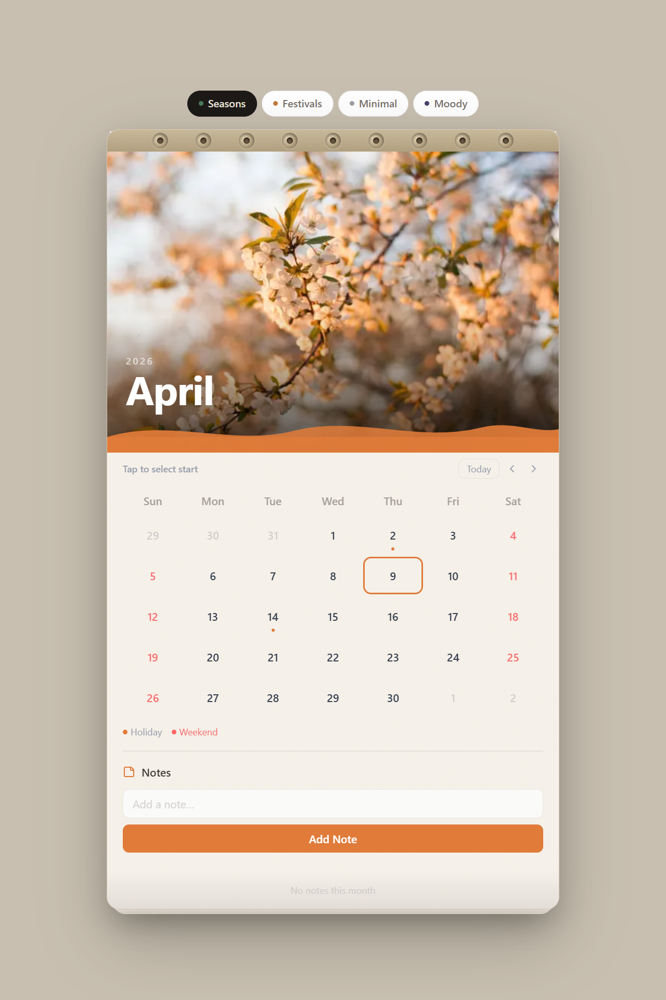
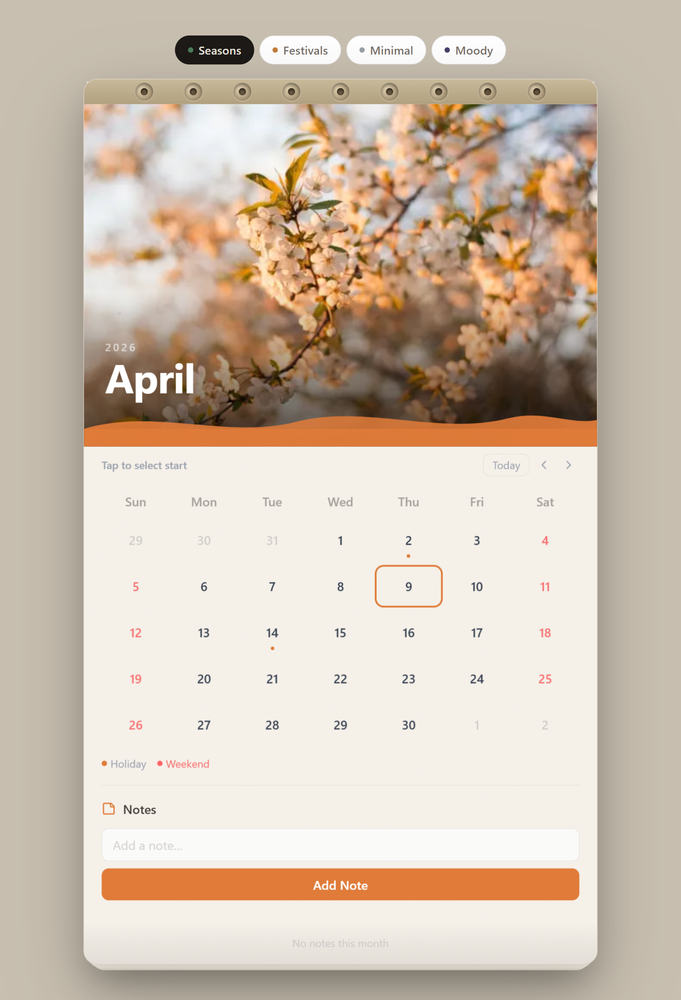
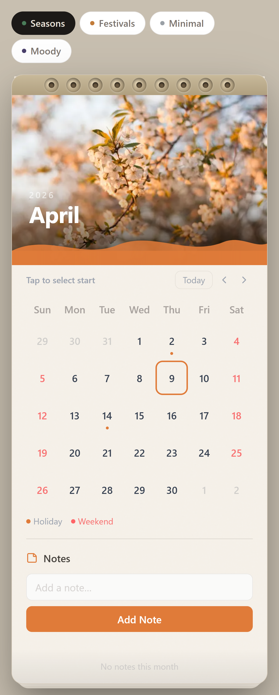
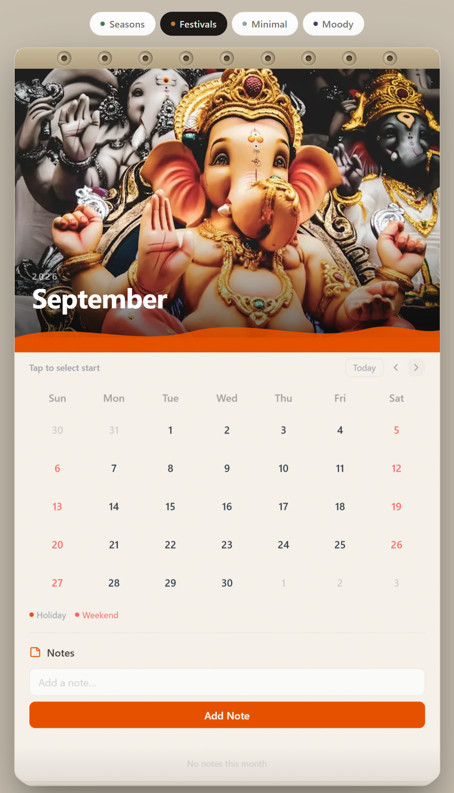
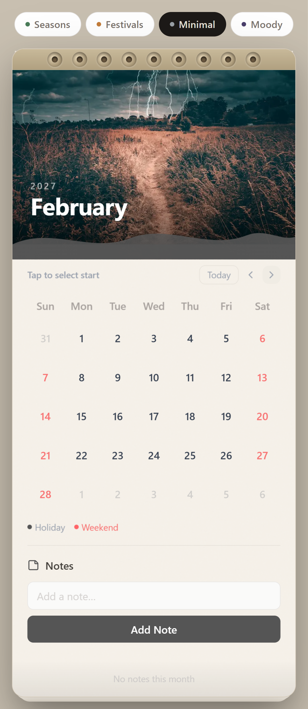
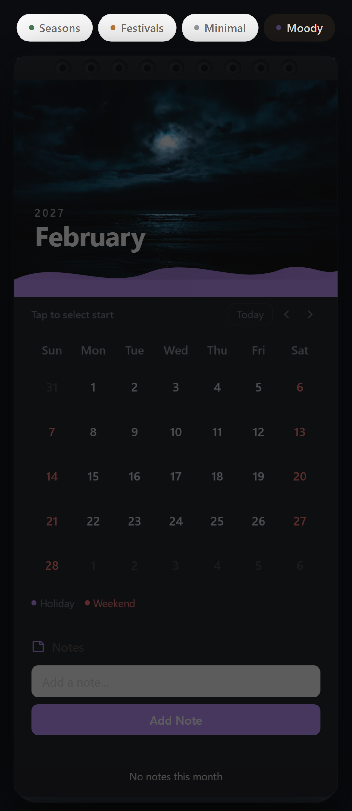
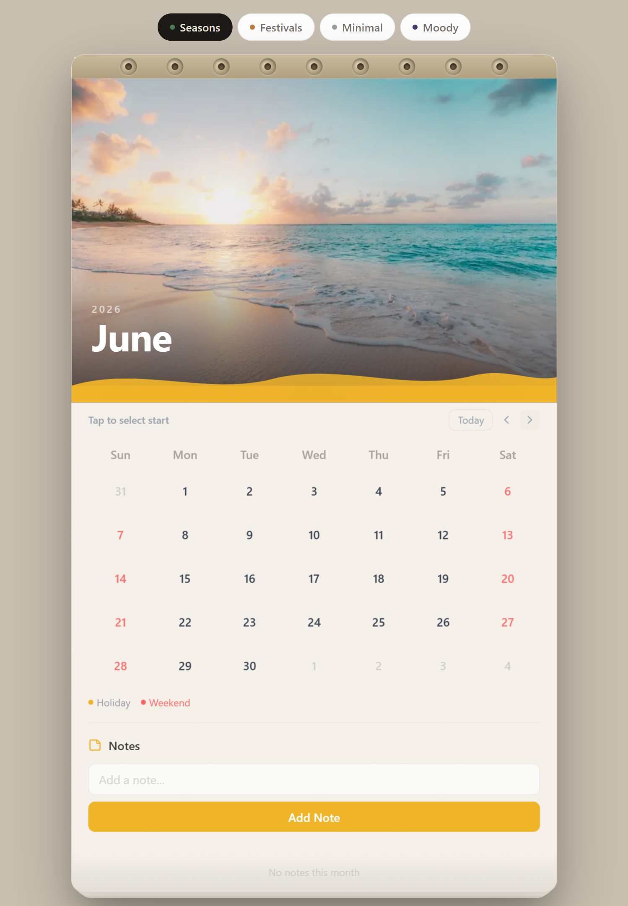
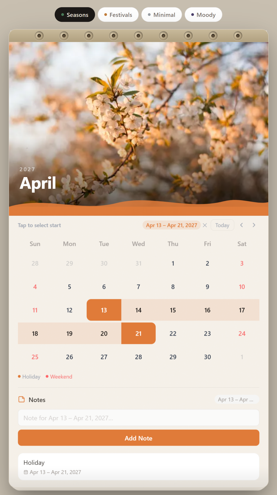

# 🗓️ My Wall Calendar

> An interactive, aesthetic wall calendar component built with **Next.js 15**, **React 19**, and **Tailwind CSS v4** — inspired by the tactile charm of a physical wall calendar.

---

## ✨ Live Demo

🔗 **[View Live →](https://my-wall-calendar-flax.vercel.app/)**  
📹 **[Watch Demo Video →](https://www.loom.com/share/af235098ce9a4f75b381b641d05d9b11)**


## 📸 Preview


## 📸 Screenshots

### 🖥️ Desktop
<p align="center">
  
</p>

### 📱 Tablet & Mobile
<p align="center">
  
  
</p>

---

## 🎨 Themes

<p align="center">
  
  
</p>

<p align="center">
  
  
</p>

---

## 📝 Notes Panel

<p align="center">
  
</p>

---

## 🚀 Features

### Core
- **Wall Calendar Aesthetic** — Paper-textured card with simulated ring binding, stacked page shadows, and a prominent hero image that changes with each month
- **Day Range Selector** — Click to set a start date, hover for a live preview of the range, click again to set the end; visual states for start, end, and in-between days; automatic swap if end < start
- **Integrated Notes Panel** — Add notes scoped to the current month, optionally tied to a selected date range; click any note to restore its range on the grid; delete with hover-reveal trash icon
- **Fully Responsive Design** — Fluid layout that stacks gracefully on mobile while preserving all functionality

### Creative Extras
- **4 Visual Themes** — _Seasons_, _Festivals_ (Indian cultural calendar), _Minimal_, _Moody (dark)_ — each with a unique accent palette, gradient, and hand-curated monthly imagery from Unsplash
- **Page-Flip Animation** — 3D perspective flip (`rotateX`) plays forward/backward depending on navigation direction
- **Ring Binding** — SVG rings rendered at the top of the calendar card to sell the physical wall-calendar illusion
- **Holiday Markers** — Indian public holidays for 2026 are annotated with a dot indicator and a tooltip on hover
- **Weekend Highlighting** — Saturday/Sunday dates are tinted red for quick visual parsing
- **Today Ring** — Today's date always shows an accent-colored outline when unselected
- **Auto Date-Range Label Pill** — A summarized label (e.g., "Jan 3 – Jan 8") appears inline near the navigation with a clear (✕) button

---

## 🛠️ Tech Stack

| Layer | Technology |
|---|---|
| Framework | Next.js 15 (App Router) |
| UI Runtime | React 19 |
| Styling | Tailwind CSS v4 |
| Date Utilities | date-fns v4 |
| Icons | lucide-react |
| Animations | Custom CSS keyframes (`@keyframes pageFlipUp/Down`) |
| Storage | Client-side React state (`useState`) — no backend |
| Type Safety | TypeScript |
| Linting | ESLint (Next.js config) |

---

## 🏗️ Project Structure

```
src/
├── app/
│   ├── globals.css          # Tailwind + custom animations + paper textures
│   ├── layout.tsx
│   └── page.tsx
├── components/
│   └── Calendar/
│       ├── CalendarRoot.tsx   # Orchestrates all state + layout
│       ├── CalendarGrid.tsx   # 7-column date grid
│       ├── CalendarHeader.tsx # Month/year heading
│       ├── DayCell.tsx        # Individual day with selection states
│       ├── HeroImage.tsx      # Top image panel with wave SVG transition
│       ├── NotesPanel.tsx     # Notes CRUD + date-range association
│       ├── PageFlip.tsx       # 3D flip animation wrapper
│       ├── RingBinding.tsx    # SVG ring decoration
│       └── ThemeSwitcher.tsx  # 4-theme pill selector
├── lib/
│   ├── calendarUtils.ts   # buildCalendarDays, formatDateRangeLabel
│   ├── constants.ts       # Theme images, Indian holidays, day/month names
│   └── theme.ts           # THEMES config + getMonthTheme()
└── types/
    └── calendar.ts        # Shared TypeScript types
```

---

## ⚙️ Local Setup

### Prerequisites
- Node.js ≥ 18
- npm / yarn / pnpm

### Steps

```bash
# 1. Clone the repo
git clone https://github.com/your-username/My-Wall-Calendar.git
cd My-Wall-Calendar

# 2. Install dependencies
npm install

# 3. Run dev server
npm run dev

# 4. Open in browser
open http://localhost:3000
```

### Other Commands

```bash
npm run build   # Production build
npm run start   # Start production server
npm run lint    # Lint codebase
```

---

## 🎨 Design Decisions

### Why a single calendar card (`maxWidth: 580px`)?
The physical wall calendar reference image showed a compact, portrait-oriented card — not a full-viewport layout. Constraining width to 580px keeps the paper metaphor intact on all screen sizes.

### Why client-side state only?
The brief explicitly said _"do not waste time developing a backend"_ — all notes and selections live in `useState` and are intentionally ephemeral per session.

### Why `date-fns` for date handling?
Lightweight tree-shakeable date library; used for `addMonths`, `subMonths`, `isBefore`, `format`, and `parseISO` — all without the timezone footguns of raw `Date` manipulation.

### Theme architecture
Each theme is a 12-element array (one per month) of `MonthTheme` objects with `bg`, `accent`, `text`, `particle`, `gradient`, and `label`. Switching themes is a single state update; the entire card re-paints via CSS color tokens.

---

## 📱 Responsive Notes

| Breakpoint | Behavior |
|---|---|
| `< 480px` | Card fills viewport width with reduced padding; ThemeSwitcher pills wrap |
| `480px – 640px` | Card at ~95% width; ring binding visible |
| `≥ 640px` | Full 580px card centered; page-flip animation fully visible |
| All sizes | Notes panel stacks below the grid; input + button stacked vertically |

---

## 🐞 Known Limitations

- Notes are stored in React state and are cleared on page refresh (no `localStorage` persistence — per brief)
- The `INDIAN_HOLIDAYS_2026` map only covers 2026; earlier/later years show no holiday markers
- The page-flip animation may appear slightly clipped on very narrow viewports (< 320px)

---

## 📄 License

This project was created as part of a frontend engineering challenge. All Unsplash images are used under the Unsplash License.